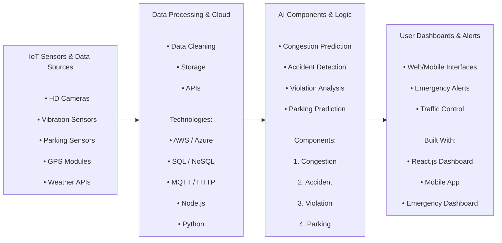

# Urban Traffic Management and Violation Detection System

## Overview

The Urban Traffic Management and Violation Detection System is an intelligent, IoT-based solution designed to revolutionize urban mobility in Sri Lanka. This integrated system addresses multiple traffic challenges through four specialized components that work in harmony to monitor, detect, predict, and respond to various traffic scenarios in real-time.

Our system combines Internet of Things technologies, and smart algorithms to create a comprehensive traffic management ecosystem that enhances road safety, reduces congestion, improves law enforcement efficiency, and provides sustainable mobility solutions.

## System Architecture



## Components

### 1. Traffic Congestion Detection and Rerouting
**Developer:** GUNARATHNA W.D.R.N (T22317230)

This component identifies and forecasts traffic congestion using AI and IoT technologies, providing drivers with optimized rerouting recommendations in real-time.

**Key Features:**
- Hybrid congestion detection combining ML classifiers with rule-based thresholds
- LSTM model for 15-30 minute traffic prediction
- Hybrid routing engine (Haversine + A* algorithm)
- Weather-aware routing and EV/fuel station integration
- Real-time visualization on web/mobile dashboards

**Technologies:** Machine Learning (Random Forest, SVM, LSTM), Haversine formula, A* algorithm, IoT sensors, GPS, spatial databases

### 2. Accident Detection and Alert System
**Developer:** Peiris I.M (IT22370082)

An automated accident detection system that identifies vehicle collisions, classifies severity, and triggers immediate emergency response protocols.

**Key Features:**
- Real-time vibration sensing with threshold-based accident detection
- Automatic severity classification (High/Medium/Low)
- Instant red LED warning lights for nearby vehicles
- Multi-level emergency response prioritization
- Separate dashboards for emergency services
- Mobile app integration for driver alerts

**Technologies:** Vibration sensors, GPS modules, LED warning systems, real-time databases, SMS/email alerts

### 3. Traffic Rule Violation Detection Using AI
**Developer:** Gunawardana N. N. (IT22335814)

Automated detection and logging of traffic violations with real-time AI analysis and voice feedback to drivers.

**Key Features:**
- Triple violation detection: speed limit, lane, and illegal parking
- YOLOv8 and TensorFlow-based AI models
- License plate recognition using OpenCV and EasyOCR
- Real-time voice assistant feedback to drivers
- React.js dashboard for traffic authorities
- Comprehensive evidence logging with timestamps and GPS

**Technologies:** YOLOv8, TensorFlow, OpenCV, EasyOCR, React.js, voice synthesis

### 4. Smart Parking Management
**Developer:** Jayathilake S.K.A.D.G (IT22363534)

Intelligent parking monitoring system that detects availability, prevents violations, and assists drivers in finding parking spaces efficiently.

**Key Features:**
- Real-time parking space monitoring using multiple sensor types
- Automated illegal parking detection and enforcement
- GPS-tagged violation alerts to authorities
- Role-based dashboard access
- Parking availability assistance for drivers
- Emergency response integration

**Technologies:** Ultrasonic/IR sensors, Arduino/ESP32, MQTT/HTTP, AWS/Azure cloud, React/Vue.js

## Dependencies

### Core Technologies
- **Frontend:** React.js, Django Mobile App Frameworks
- **Backend:** Node.js, Django, Database Systems (SQL/NoSQL)
- **AI/ML:** TensorFlow, YOLOv8, OpenCV, EasyOCR, scikit-learn
- **IoT:** Arduino, ESP32, Sensor networks, GPS modules
- **Communication:** REST APIs, WebSocket, SMS/Email gateways

### Key Libraries & Frameworks
- Machine Learning: TensorFlow, Keras, PyTorch, OpenCV, EasyOCR
- Data Processing: Pandas, NumPy, SciPy
- Mapping & Routing: Leaflet, OpenStreetMap, Graph algorithms
- Real-time Communication: Socket.io, MQTT clients
- Security: OAuth2, TLS/SSL encryption

## Installation & Setup

```bash
# Clone the repository
https://github.com/devindaJJ/fyp_research.git
cd fyp_research

# Install dependencies
npm install  # For frontend components
pip install -r requirements.txt  # For AI/ML components

# Environment configuration
cp .env.example .env
# Configure your environment variables

# Start the application
npm start    # Frontend
python app.py # Backend services
